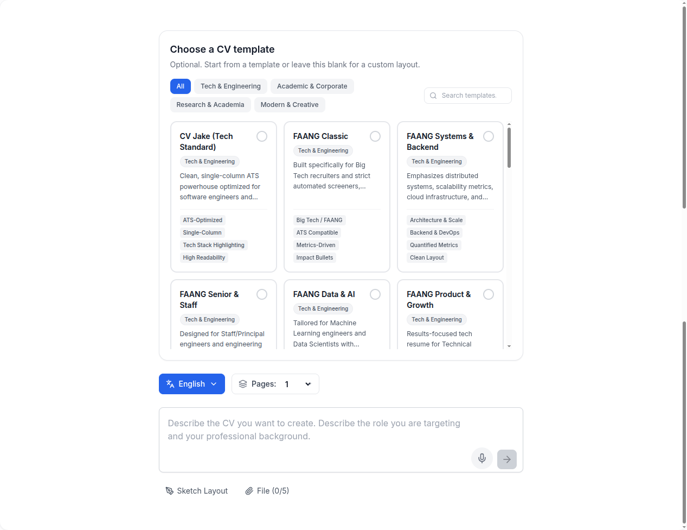
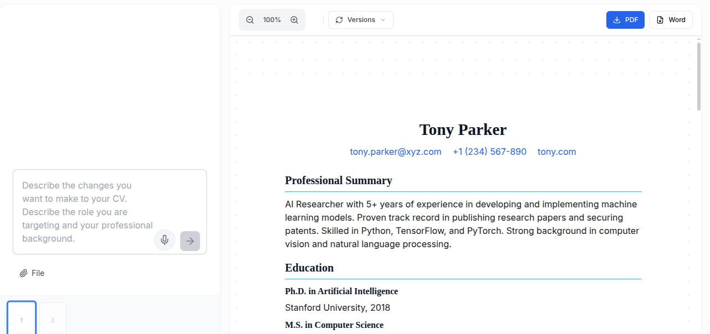
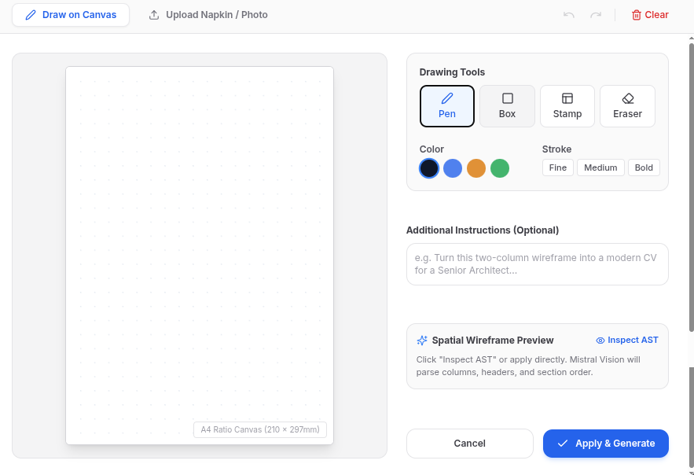
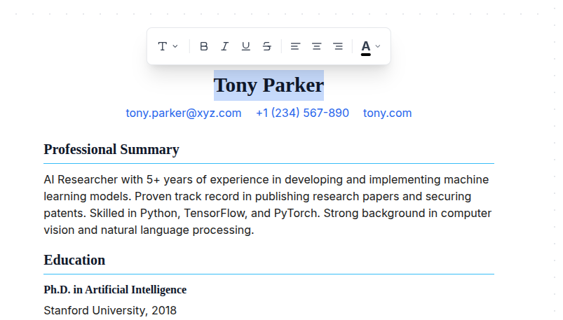
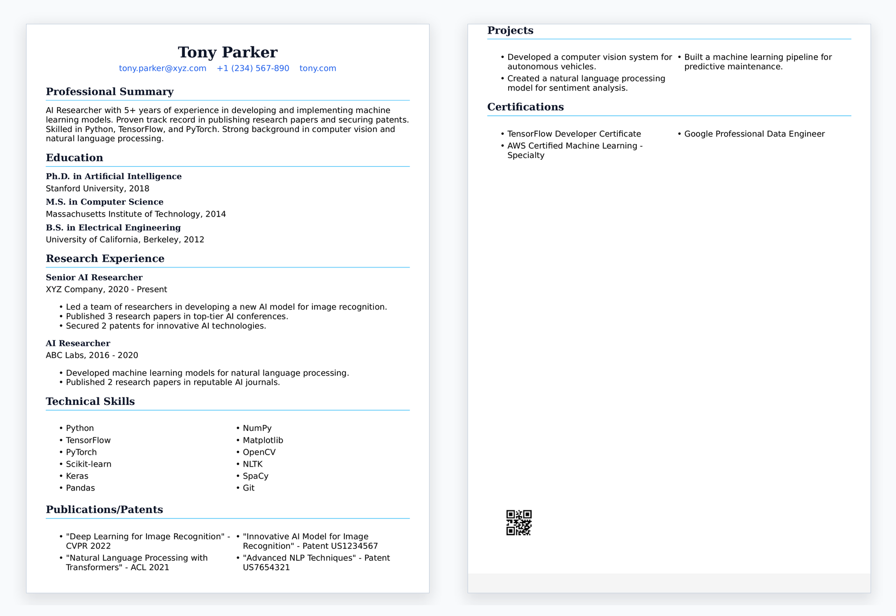
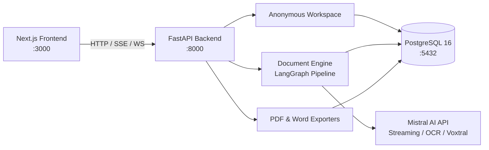

<div align="center">

# open-cvbaba

**Open-source, local-first AI document designer and creator for CVs, resumes, cover letters, and documents.**

[](LICENSE)
[](https://nextjs.org/)
[](https://fastapi.tiangolo.com/)
[](https://www.postgresql.org/)
[](https://mistral.ai/)
[](docker-compose.yml)

[Quick Start](#-quick-start) • [Visual Walkthrough](#-visual-walkthrough) • [Features](#-key-features) • [Sample PDF](#-sample-output) • [Architecture](#-architecture) • [Contributing](#-contributing)

</div>

---

## 📖 Overview

**open-cvbaba** turns prompts and voice notes into polished, fully editable HTML documents, streams generation in real time, preserves version history in PostgreSQL, and exports directly to print-ready PDF and editable Microsoft Word (`.docx`).

Designed to run locally with Docker without external accounts, OAuth, passwords, tracking, billing, or cloud lock-in.

---

## 📸 Visual Walkthrough

### 1. Interactive Form & Template Selection
Choose from 24 curated templates, configure target roles, record live voice notes via Voxtral, or upload existing resume files:

<div align="center">
  
</div>

### 2. Real-Time Streaming Document Generation
Watch your document generate live with sub-second Server-Sent Events (SSE) streaming powered by Mistral AI:

<div align="center">
  
</div>

### 3. Spatial Wireframe Canvas & Layout Sketching
Sketch custom document layouts directly or upload napkin sketches and photos for automated AST structuring:

<div align="center">
  
</div>

### 4. Direct In-Place Text Editing
Edit any section, header, or bullet point directly on the canvas without leaving your document workspace:

<div align="center">
  
</div>

### 5. Final Document & Instant 1-Click Export
Download clean, ATS-friendly documents as print-ready PDF (WeasyPrint) or editable Microsoft Word (`.docx`) files with one click:

<div align="center">
  
</div>

---

## 📄 Sample Output

Here is an example CV generated end-to-end with open-cvbaba and exported directly to PDF:

- 📥 **[Download Sample Exported CV (AI_Research_CV.pdf)](docs/examples/AI_Research_CV.pdf)**

---

## ✨ Key Features

- **⚡ Local-First & Privacy by Default**: Runs entirely on your local machine with Docker. Anonymous local workspaces keep your documents and data completely private.
- **🤖 Real-Time Streaming AI Generation**: Generates complete, beautifully styled documents with real-time Server-Sent Events (SSE) streaming powered by Mistral AI.
- **🎙️ Real-Time Voice-to-CV Dictation**: Speak into your microphone to dictate experience, background, and skills using Mistral Voxtral real-time 16 kHz PCM transcription over WebSockets.
- **📄 Multimodal Document Import (Mistral OCR)**: Upload existing PDF resumes or photos to automatically extract content and transform them into structured documents.
- **🎨 WYSIWYG Shadow DOM Preview & Direct In-Place Editing**: Isolated Google Docs-style document sandbox with realistic A4 pagination, drag-and-drop page reordering, and direct text editing.
- **📥 One-Click Instant PDF & Word Export**: Download print-ready PDFs (via WeasyPrint) and editable Microsoft Word (`.docx`) files with a single click.
- **📚 24 Curated Templates**: Rich, description-based templates tailored for Tech & Engineering, Academic & Corporate, Research, and Modern styles.
- **🕒 Version History & Snapshots**: Automated document snapshots and instant one-click rollback to any previous version.
- **🌓 Modern Dark & Light Mode**: Accessible, responsive interface tailored for both mobile and desktop screens.

---

## 🚀 Quick Start

### Prerequisites

- [Docker](https://docs.docker.com/get-docker/) & [Docker Compose](https://docs.docker.com/compose/)
- A [Mistral AI API Key](https://console.mistral.ai/)

### 1. Clone the Repository

```bash
git clone https://github.com/ialim0/open-cvbaba.git
cd open-cvbaba
```

### 2. Configure Environment

Copy the example configuration:

```bash
cp .env.example .env
```

Open `.env` and add your Mistral API key:

```ini
MISTRAL_API_KEY=your_mistral_api_key_here
```

### 3. Launch with Docker Compose

```bash
docker compose up --build
```

- **Frontend**: [http://localhost:3000](http://localhost:3000)
- **Backend API**: [http://localhost:8000](http://localhost:8000)
- **API Documentation**: [http://localhost:8000/cb/doc-cb](http://localhost:8000/cb/doc-cb)

---

## 💻 Manual Local Development (Without Docker)

If you prefer running services natively:

### Backend Setup

```bash
# 1. Navigate to backend directory
cd be-open-cvbaba

# 2. Create and activate virtual environment
python3 -m venv .venv
source .venv/bin/activate  # On Windows: .venv\Scripts\activate

# 3. Install dependencies
pip install -r requirements.txt

# 4. Copy environment configuration
cp .env.example .env

# 5. Run database migrations
alembic upgrade head

# 6. Start the FastAPI development server
uvicorn app.main:app --reload --port 8000
```

### Frontend Setup

```bash
# 1. Navigate to frontend directory
cd fe-open-cvbaba

# 2. Install dependencies
npm install

# 3. Copy environment configuration
cp .env.example .env.local

# 4. Start Next.js development server
npm run dev
```

Open [http://localhost:3000](http://localhost:3000) in your browser.

---

## 🏛️ Architecture



For comprehensive architectural details, request lifecycles, and data models, see [docs/ARCHITECTURE.md](docs/ARCHITECTURE.md).

---

## 📋 Environment Variables Reference

| Variable | Default | Description |
| --- | --- | --- |
| `MISTRAL_API_KEY` | *(Required for AI)* | Your Mistral AI API key |
| `DATABASE_URL` | `postgresql://...` | PostgreSQL connection string |
| `MISTRAL_MODEL` | `mistral-large-latest` | Primary text generation model |
| `MISTRAL_PLANNING_MODEL` | `mistral-large-latest` | Document planning & reasoning model |
| `MISTRAL_CODE_MODEL` | `codestral-latest` | HTML / CSS generation model |
| `MISTRAL_TRANSCRIPTION_MODEL` | `voxtral-mini-latest` | Audio file transcription model |
| `MISTRAL_REALTIME_MODEL` | `voxtral-mini-transcribe-realtime-2602` | Real-time WebSocket audio streaming model |
| `CORS_ORIGINS` | `["http://localhost:3000"]` | Allowed CORS origins for API requests |
| `MINIO_ENDPOINT` | `http://localhost:9000` | S3/MinIO endpoint for optional asset storage |
| `NEXT_PUBLIC_API_BASE_URL` | `http://localhost:8000` | Frontend backend API URL |

---

## 📁 Repository Structure

```text
open-cvbaba/
├── be-open-cvbaba/              # FastAPI backend service
│   ├── app/
│   │   ├── api/routes/          # Endpoints (chat, export, OCR, voice, feedback)
│   │   ├── models/              # SQLAlchemy database models
│   │   ├── schemas/             # Pydantic schemas
│   │   ├── services/            # Mistral AI, PDF, Word, and OCR services
│   │   └── templates/           # Document HTML/CSS templates
│   ├── Dockerfile               # Backend Docker container definition
│   └── requirements.txt         # Python dependencies
├── fe-open-cvbaba/              # Next.js 15 frontend application
│   ├── src/app/
│   │   ├── activity/            # Document creation and editing workspace
│   │   ├── components/          # React components (PdfPreview, Sidebar, Forms)
│   │   ├── contexts/            # Application state contexts (Theme, Sidebar)
│   │   └── hooks/               # Custom hooks (speech-to-text, streaming)
│   ├── Dockerfile               # Frontend Docker container definition
│   └── package.json             # Frontend dependencies
├── docs/                        # Architectural specifications and visual assets
│   ├── images/                  # Product screenshots & walkthrough assets
│   ├── examples/                # Sample exported PDF documents
│   └── ARCHITECTURE.md          # Technical architecture deep dive
├── docker-compose.yml           # Multi-container orchestration (API, UI, PostgreSQL, MinIO)
├── CONTRIBUTING.md              # Contribution guide and development workflow
├── CODE_OF_CONDUCT.md           # Community guidelines
└── LICENSE                      # MIT License
```

---

## 🤝 Contributing

Contributions of all kinds are welcome! Whether you are fixing a bug, adding a new template, improving accessibility, or refining documentation:

1. Fork the repository and create a branch (`git checkout -b feat/your-feature`).
2. Test your changes locally (`npm run type-check` and `python3 -m compileall -q be-open-cvbaba/app`).
3. Commit your changes with a descriptive message.
4. Open a Pull Request.

Please see [CONTRIBUTING.md](CONTRIBUTING.md) for full details and review our [Code of Conduct](CODE_OF_CONDUCT.md).

---

## 📜 License

open-cvbaba is open-source software licensed under the [MIT License](LICENSE).