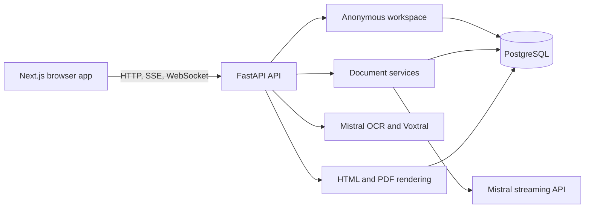

# open-cvbaba

Open-source, local-first AI document creation for CVs, letters, books, and ebooks.

open-cvbaba turns a prompt into an editable HTML document, streams generation in real time, preserves document history in PostgreSQL, and renders the result for PDF export. It is designed to run locally with Docker and does not require accounts, passwords, OAuth, billing, or an external identity provider.

## Project origin

open-cvbaba started as research in 2024.

The initial motivation was practical. In 2024, AI tools could generate useful text and code, but reliably producing a real, polished, compilable document end to end was still difficult. A common workflow was to copy generated code from an LLM into another tool, compile it, discover errors or poor layout, and repeat the process. The friction was especially visible with LaTeX.

The research therefore focused on the complete prompt-to-document path: generation, layout, compilation, preview, editing, and export. The objective was not only to generate text, but to produce a document that could be reviewed and used immediately.

### Research projects that came before

- [latex-compiler-api](https://github.com/ialim0/latex-compiler-api) explored making LaTeX compilation accessible from a browser.
- [db-cvbaba](https://github.com/ialim0/db-cvbaba) supported structured annotation of high-quality LaTeX CV data for model-training experiments.

After creating an initial dataset of approximately 50 CV PDFs, the next research question was how to create a larger agentic prompt-to-PDF workflow with real-time browser editing. LaTeX was valuable for research, but too computationally expensive for a self-bootstrapping product workflow. Modern language models were already capable of generating HTML, and HTML provided a more practical WYSIWYG editing experience. That direction became CVBaba and attracted substantial usage and interest, including requests from investors in the UK and United States.

The hosted project was later paused because of compute costs and the rapidly changing AI-agent landscape. open-cvbaba is the open-source continuation: a smaller, self-hostable foundation for experimenting with reliable AI-assisted document creation.

## Architecture

The system is divided into a frontend, a Python API, PostgreSQL, a rendering layer, and one AI provider layer.



| Component | Responsibility |
| --- | --- |
| `fe-open-cvbaba` | Next.js interface for document selection, prompting, editing, preview, and export. |
| `be-open-cvbaba` | FastAPI API, orchestration, streaming, rendering, and persistence. |
| PostgreSQL | Stores workspaces, documents, versions, pages, comments, and notes. |
| Mistral | Native streaming generation, OCR, and Voxtral transcription. |
| Docker Compose | Runs the complete local stack. |

### Request flow

1. The user selects CV, letter, book, or ebook on the home page.
2. The frontend sends the prompt and workspace identifier to the API.
3. The API prepares instructions, template context, and history.
4. Mistral streams HTML chunks back through the API.
5. The frontend renders the chunks as an editable document preview.
6. The completed document and history are stored in PostgreSQL.
7. The rendering layer prepares HTML for preview and PDF export.

Uploaded PDFs and images are processed with Mistral OCR. Browser voice input is converted to 16 kHz PCM and sent to Voxtral realtime transcription.

More detail: [docs/ARCHITECTURE.md](docs/ARCHITECTURE.md).

## Run locally

Requirements: Docker and Docker Compose.

```bash
cp .env.example .env
# Add your Mistral key to .env
docker compose up --build
```

Open http://localhost:3000. The API is available at http://localhost:8000.

`MISTRAL_API_KEY=your_mistral_api_key`

## Design principles

- Local-first development with a simple Docker workflow.
- PostgreSQL as the source of truth for document history.
- One explicit AI provider: Mistral.
- Streaming by default for long document generation.
- Editable HTML as the intermediate document format.
- No authentication subsystem in the local open-source edition.

## Contributing

Issues, documentation improvements, templates, evaluation datasets, rendering fixes, and provider-independent workflows are welcome. Keep changes focused, document behavior changes, and validate backend compilation and Docker Compose configuration before opening a pull request.

## License

See the repository license file.
